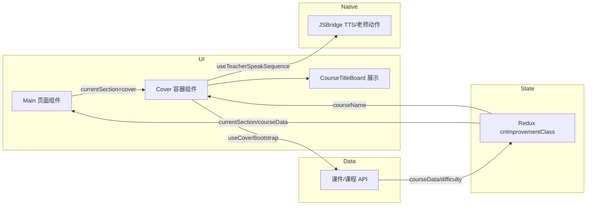

# 1v1 语文提升课 — TRD（自选 R 范围）

> **变更目录**: `seedpacespec/changes/active-change/cn-improvement-class/`  
> **PRD**: `specs/cn-improvement-class-prd.md`  
> **生成模式**: D — 自选 R（用户勾选）  
> **本次纳入范围**: **仅 R01 — 封面与课程初始化**  
> **日期**: 2026-04-07 | **状态**: 待评审  
> **输入上下文**: architecture.md ✅ | design.md ✅ | 接口文档 ❌（§4.2 为推断） | 测试用例 ❌  

---

## 1. 概述

本文件描述 **封面环节（R01）** 的技术实现方案。封面环节做的事情不多但涉及面广：黑板上展示课程名称、AI 老师正面播报一段含学生姓名的欢迎话术、后台同时并行预加载后续三个环节（趣味导入 / 知识讲解 / 拓展延伸）的课件数据、根据学生知识点掌握程度匹配难度档位，最后在课程目标数据生成成功后自动跳转到「我的目标」环节。

R02 及后续环节不在本文范围内，但本文会明确定义 R01 和 R02 之间的衔接点（即什么条件下触发跳转、跳转时 Redux 里应该准备好哪些数据）。

**覆盖需求**: R01  

**设计决策引用**（`design.md`）:

- D1 — 复用 `ImprovementClassContainer` 等共享壳层。  
- D2 — 环节切换与预加载状态统一用 Redux 管理（`currentSection`、`courseData`、`coursewareLoading` 等）。  

**TRD 补充决策**:

- **R01-UI-1**: 封面 UI 独立为 `container/Cover/`，由 `container/Main` 在 `currentSection === 'cover'` 时挂载。之所以不把封面逻辑直接写在 Main 里，是因为封面环节自带一整套异步编排（预加载 + 目标请求 + TTS 播报），如果塞在 Main 里会让 Main 迅速膨胀，而且后续 R02~R23 每个环节都会有自己的逻辑，全堆在 Main 里根本维护不了。  
- **R01-PRELOAD-1**: 「拉取课程目标」和「预加载三路课件」设计为并行执行、各自独立。跳转到 R02 的条件（我们内部叫"门闩"）只看目标数据是否就绪，不等课件预加载完成。这样做的原因是课件预加载是"锦上添花"——成功了后续环节加载更快，失败了也可以在进入对应环节时重试，不应该因为它而卡住用户在封面上干等。

**改动热区**:

- `CnImprovementClass/container/Cover/`（新建）  
- `CnImprovementClass/container/Main/index.tsx`（编排、分发 Cover）  
- `store/types/cnImprovementClass.d.ts`、`reduxStore/reducers|actions|constants/cnImprovementClass.ts`（预加载状态字段若需显式建模）  
- 与数学课类似的 **JSBridge / TTS / 老师动作** 调用封装（路径遵循现有 `OneOneImprovementClass` 调用方式，本文不臆造 API 名）

---

## 2. 需求覆盖矩阵

| PRD | 简述 | TRD 章节 | 涉及模块/文件 | 决策 |
|-----|------|----------|---------------|------|
| R01 | 封面、预加载、难度匹配、自动进 R02 | §4.1–§4.7 | Cover, Main, Redux, 数据层, 逻辑层 | D1, D2, R01-UI-1, R01-PRELOAD-1 |

---

## 3. 架构图示（数据流）



---

## 4. 改动方案

### 4.1 模型层

**覆盖**: R01  

**设计意图**: 封面和预加载需要用到的字段，大部分已经在现有的 `CourseData` 类型里了（课程 ID、课程名、课程目标等），所以不另起一个全新的类型，而是在已有结构上做增量扩展。

有考虑过把预加载的状态信息（比如"课件加载是否出错"）也塞进 `CourseData`，但想了想不合适——`CourseData` 应该只映射后端返回的课程数据字段，而预加载状态是纯前端的运行时概念。如果把两者混在一起，后续别人看到 `CourseData.segmentPreloadError` 这个字段会困惑"这到底是后端返的还是前端自己加的？"。所以拆了一个独立的 `CoverPreloadMeta` 来放前端预加载状态，让 `CourseData` 保持纯净——只映射后端字段。新增字段全部用可选类型（`?`），这样新老数据格式都能兼容，不会因为老接口没返回某个字段就报类型错误。

**现有类型**（`client/src/store/types/cnImprovementClass.d.ts`）:

- `CourseData`: `courseId`, `courseName`, `courseGoals`  
- `DifficultyLevel`: `basic` | `advanced` | `challenge`（对应 PRD 基础/进阶/拔高）

**建议增量**（**基于推断**，接口定稿后对齐）:

```typescript
interface CoverPreloadMeta {
  goalReady: boolean;
  segmentPreloadError?: string | null;
}
```

| 文件 | 改动 |
|------|------|
| `client/src/store/types/cnImprovementClass.d.ts` | 视接口增加 `CoverPreloadMeta` 或等价字段；或与 `courseData` 合并 |

---

### 4.2 数据层

**覆盖**: R01  

**设计意图**: 数据层的 API 调用遵循项目已有的 `common/adapter` 模式，不另起炉灶。由于接口文档还没定型，本节所有的 URL 和字段都是推断出来的占位符，联调前必须替换成真实契约。

之所以把课件预加载设计为分三路并行请求（趣味导入、知识讲解、拓展延伸各一路），而不是合成一个大请求一次拉回来，是考虑到这三个环节的课件数据量差异很大，合并请求会导致"木桶效应"——最慢的那一路拖慢整体。分开请求的话，先加载好的环节可以先用，用户进入后续环节时大概率已经有缓存了。

**接口约定**（推断，需替换为真实契约）:

| 能力 | 方法/路径（占位） | 请求要点 | 响应映射 |
|------|-------------------|----------|----------|
| 拉取课程元数据与目标 | `GET /api/cn-course/{courseId}/goal`（示例） | `courseId`, 学生知识点得分 | `CourseData` + `goalReady` |
| 预加载课件包 | `GET /api/cn-course/{courseId}/segments` 或分三路并行 | `difficulty` 由匹配规则传入 | 写入 `coursewareData` 缓存或分段 store |

**关键逻辑**（伪代码）:

```
onCoverMount(courseId):
  profile = getStudentProfile()
  difficulty = matchDifficulty(profile.mastery)
  dispatch(setDifficulty(difficulty))

  goalPromise = fetchCourseGoal(courseId, difficulty)
  preloadPromise = Promise.all([
    prefetch('fun_intro', courseId, difficulty),
    prefetch('knowledge', courseId, difficulty),
    prefetch('extension', courseId, difficulty),
  ]).catch(err => dispatch(setPreloadError(err)))

  goal = await goalPromise
  dispatch(setCourseData(goal))
  dispatch(setCurrentSection('goal'))
```

> 封面组件挂载时做两件事。第一件事是"确定难度并拉取课程目标"：先从已有数据源读取学生的知识点掌握情况，调用难度匹配函数算出应该用哪个档位（进阶还是拔高），然后把难度写入 Redux，接着发请求拉课程目标。第二件事是"并行预加载后续课件"：同时向后端请求趣味导入、知识讲解、拓展延伸三个环节的课件数据。这两件事是并行跑的，互不阻塞。课件预加载即使全部失败，也只是在 Redux 里记一个错误标记，不阻止跳转——因为后续环节进入时还可以重新拉取。但课程目标必须拉成功，拿到数据之后才会把 `currentSection` 切到 `'goal'`，触发页面跳到下一个环节。

---

### 4.3 状态层

**覆盖**: R01 | **来源**: D2  

**设计意图**: 所有跨环节共享的数据（当前处于哪个环节、难度档位、课程目标内容）都放在 Redux 里，而不是用组件内部状态或 Context。选 Redux 是因为这些数据不只封面用——R02「我的目标」环节需要读 `courseData` 来展示目标内容，后续 R03+ 环节需要读 `difficulty` 来决定加载哪个难度的课件。如果放在 Cover 组件的局部状态里，Cover 卸载后数据就丢了，下一个环节还得重新请求。

有考虑过用 React Context，但 Context 的问题是任何一个值变化都会导致所有消费者重新渲染，在一节课这么多环节的场景下性能开销不可控。Redux 配合 `useSelector` 可以精确订阅，只有关心的那个字段变化时才会重新渲染，更适合这种"多环节共享少量关键状态"的场景。

环节切换统一通过 `dispatch(setCurrentSection(...))` 这一个出口来做，不允许组件直接 setState 来切换页面，这样后续如果要做"断点续学"（用户中途退出再进来能回到上次的环节），只需要在进入时从后端读取上次的 `currentSection` 写入 Redux 就行，不用改各环节的代码。

| 状态 | 归属 | 说明 |
|------|------|------|
| `currentSection` | Redux | 当前处于哪个环节。封面阶段为 `'cover'`，目标生成成功后切到 `'goal'` |
| `difficulty` | Redux | 封面初始化时根据学情匹配写入，后续环节用它决定加载哪个难度的课件 |
| `courseData` | Redux | 课程目标的文案、语音 URL 等，封面阶段写入，R02 阶段消费展示 |
| `coursewareLoading` / `coursewareError` | Redux | 三路课件预加载的状态。和"课程目标是否就绪"是分开管理的，互不干扰 |

| 文件 | 改动 |
|------|------|
| `reduxStore/actions/cnImprovementClass.ts` | 若有独立 `setGoalReady` / `setPreloadStatus` |
| `reduxStore/reducers/cnImprovementClass.ts` | 处理上述 action |
| `reduxStore/constants/cnImprovementClass.ts` | 常量导出 |

---

### 4.4 UI 层

**覆盖**: R01  

**设计意图**: 这个环节的 UI 结构其实很简单——黑板上显示课程名，老师在旁边播报欢迎语，后台默默加载数据。但它背后的异步逻辑不简单（并行预加载、目标请求、TTS 播报、门闩跳转），所以组件拆分的关键考量不在 UI 复杂度，而在逻辑隔离。

路由入口由 `Main` 承担，它是整个语文提升课的"总调度"，负责根据 `currentSection` 决定渲染哪个环节的组件。封面环节的所有异步逻辑（预加载、TTS、跳转）都内聚在 `Cover` 容器组件里，不污染 `Main`——因为后续每个环节（R02 我的目标、R03 趣味导入……）都会有各自的容器组件，如果把各环节的逻辑都写在 Main 里，Main 很快就会变成一个几千行的"上帝组件"。壳层（顶栏、底栏、背景）全部复用数学课已有的 `ImprovementClassContainer` 公共组件，不重复造。

#### 4.4.1 组件树总览

```
Main (页面, useSelector(currentSection), 可选 useCnSectionRouter)
└── ImprovementClassContainer ⭐ (公共壳层, D1)
    ├── menuConfig / 顶栏等（由 Container 统一处理）
    └── [currentSection === 'cover' 时]
        └── Cover (容器, useCoverBootstrap + useTeacherSpeakSequence)
            ├── ImprovementClassBackground ⭐（可选包裹）
            └── CourseTitleBoard (展示, props: courseName)
```

#### 4.4.2 公共组件汇总

| 组件 | 职责 | 复用场景 | 状态 |
|------|------|----------|------|
| `ImprovementClassContainer` | 顶栏标签、底栏槽位、菜单等 | 语文/数学提升课全课 | 已有，直接复用 |
| `ImprovementClassBackground` | 黑板背景与主题 | 各环节中部课件区 | 已有，按需包裹 Cover |
| `PageSwitcher` | 底部翻页 | R20 正式讲课界面 | 已有；**R01 关闭** |
| `RaiseHand` | 举手入口 | R20 | 已有；**R01 关闭** |

#### 4.4.3 逐组件设计

**组件类型说明**（本变更涉及）:

| 类型 | 组件 |
|------|------|
| 页面组件 | `Main` |
| 容器组件 | `Cover` |
| 展示组件 | `CourseTitleBoard` |
| 公共组件 | `ImprovementClassContainer`、`ImprovementClassBackground`（⭐） |

---

**`Main`** — 语文提升课路由入口 | **页面** | R01（及后续环节分发）

- **数据来源**: `useSelector(state => state.cnImprovementClass.currentSection)`；`courseId` 来自路由 props  
- **内部状态**: 无强制；若仅 `switch(section)` 渲染可无 `useState`  
- **职责**: 挂载 `ImprovementClassContainer`；根据 `currentSection` 值决定渲染哪个环节的子组件  
- **向下传递**: `courseId` → `Cover`；壳层配置：`pageSwitcher.visible=false`、`raiseHand.visible=false`（R01 不需要翻页和举手）  

> Main 是整个语文提升课的路由入口和环节调度中心。它自己不做任何业务逻辑，只从 Redux 读取 `currentSection` 的值，然后用一个 `switch` 决定渲染哪个环节的容器组件（R01 阶段渲染 Cover，未来 R02 渲染 CourseObjectives，依此类推）。所有具体的业务逻辑——数据预加载、TTS 播报、门闩判断——都下沉到各环节自己的容器组件里去处理。这样做的好处是 Main 永远保持简洁（可能只有几十行），不管课程有多少个环节，Main 都只是一个"分发器"。需要特别注意的是，不要在 Main 里写任何 `setTimeout` 模拟加载或门闩逻辑，这些东西属于 Cover 和 `useCoverBootstrap`。

**`ImprovementClassContainer`** — 壳层 | ⭐ **公共组件** | R01, R20

- **Props**: 与现网一致（`pageSwitcher`、`raiseHand`、`menuConfig` 等）  
- **复用场景**: `OneOneImprovementClass`、`CnImprovementClass`  
- **说明**: R01 关闭翻页与举手，与 PRD 一致  

**`Cover`** — 封面环节 | **容器** | R01

- **数据来源**: `useSelector` → `courseName` / `courseData`；`useCoverBootstrap(courseId)`（§4.5）；`useTeacherSpeakSequence()`（§4.5）  
- **内部状态（关键）**: 消费 `useCoverBootstrap` 返回的 `phase` 和 `error` 来驱动 Loading / 错误重试的 UI；纯视觉动效类的 `useState`（如入场动画是否播完）留在 Cover 内部，不上提  
- **向下传递**: `courseName` → `CourseTitleBoard`  

> Cover 是封面环节的"大脑"。虽然它渲染出来的 UI 很简单（一块黑板 + 课程标题），但它在背后做了不少事：组件挂载时同时启动两条并行线——一条是通过 `useCoverBootstrap` 去匹配难度、请求课程目标、预加载课件；另一条是通过 `useTeacherSpeakSequence` 让 AI 老师播报欢迎语。两条线互不阻塞，哪个先完成都不影响另一个。当课程目标数据拉取成功后，Cover 内部会通过 Redux 把 `currentSection` 切到 `'goal'`，触发 Main 卸载 Cover、渲染下一个环节的组件。
>
> 之所以把 Cover 从 Main 里拆成独立的容器组件，是因为它集成了异步预加载、Redux 门闩判断、原生桥调用这三类完全不同性质的副作用。如果这些逻辑直接写在 Main 里，Main 就必须同时关心"R01 的预加载逻辑"和"根据 currentSection 渲染不同环节"这两件事，职责混乱。而且后续每个环节都有自己的初始化逻辑，如果全堆在 Main 里，光 R01~R23 的初始化代码就够 Main 吃一壶了。拆出来之后，Main 只管分发，Cover 只管封面的事，各管各的。

**`CourseTitleBoard`** — 黑板课程名 | **展示** | R01

- **Props**: `courseName: string`（或 `title: string`）  
- **数据来源**: 仅 Props  
- **内部状态**: 无  
- **说明**: 视觉可参考 `OneOneImprovementClass/container/CourseName`，语文侧独立组件以免耦合数学课的类型定义  

#### 状态归属决策（核心 review 点）

| 状态 | 归属 | 理由 |
|------|------|------|
| `currentSection` / `difficulty` / `courseData` | Redux | 跨环节共享——R02 要读 courseData 展示目标，后续环节要读 difficulty 决定课件难度 |
| 目标加载阶段（phase）、课件预加载错误 | `useCoverBootstrap` 返回值（可选同步到 Redux） | 这些状态的生命周期和 Cover 组件一致，Cover 卸载后就不需要了，所以首选放在 Hook 里 |
| 封面局部动效（如入场动画是否播完） | `Cover` 内 `useState` | 纯 UI 状态，只有 Cover 自己用 |
| 欢迎语字幕（若产品要求上屏显示） | `Cover` 内 `useState` | 不需要跨组件共享，显示一次就完了 |

#### 4.4.4 需求实现链路

```
R01 黑板课程名:
  Main 根据 currentSection 渲染 Cover → Cover 从 Redux 读 courseName → 通过 props 传给 CourseTitleBoard 展示

R01 预置欢迎语 + 姓名:
  Cover 挂载时调用 buildWelcomeUtterance 拼装话术 → 传给 useTeacherSpeakSequence → 通过 JSBridge 让老师播报

R01 预加载 + 成功进「我的目标」:
  Cover 挂载时调用 useCoverBootstrap → 内部匹配难度 + 并行请求目标和课件 → 目标成功后 dispatch 切 currentSection → Main 检测到变化渲染 R02

R01 难度匹配:
  useCoverBootstrap 内部调用 matchCnDifficultyFromMastery → 根据学情返回难度档位 → dispatch 写入 Redux

R01 老师动作 speakGroup1:
  Cover 调用 useTeacherSpeakSequence.speak → Hook 内部通过 JSBridge 触发安卓侧的老师正面动作和 TTS
```

#### 4.4.5 关键交互流（异步）

封面组件挂载后，内部同时启动两条并行的异步流程：

**流程 A — 欢迎播报**：Cover 调用 `buildWelcomeUtterance` 拼好话术文本，然后通过 `useTeacherSpeakSequence.speak()` 发给安卓侧播报。这条线默认不阻塞跳转——也就是说即使老师还没说完欢迎语，只要课程目标拉取成功了就可以跳转。如果产品后续要求"必须等欢迎语说完才跳转"，只需要在评审后把两条线改为串行即可（等 A 完成再执行 B 的跳转 dispatch）。

**流程 B — 数据初始化与门闩**：`useCoverBootstrap` 先匹配难度并 dispatch 到 Redux，然后并行发起"课程目标请求"和"三路课件预加载"。课程目标请求成功后，把目标数据写入 Redux 的 `courseData`，然后 dispatch `currentSection = 'goal'`，触发 Main 渲染下一个环节。课件预加载如果失败，只在 Redux 里记录错误，不阻塞跳转。

**组件卸载时**：Cover unmount 时会取消正在进行中的 TTS 播报（通过 `useTeacherSpeakSequence.cancel()`）和未完成的网络请求（通过 abort），防止组件已经不在了但回调还在往 state 里写数据。

---

### 4.5 逻辑层

> **本节重点**：哪些逻辑被提取出组件、**为什么**、**用什么承载**、**和哪些组件关联**。  
> 组件私有的琐碎状态（如 `useState(isOpen)`、仅控制本地动效的 `useState`）**不在此列**，只记录被提取出来的逻辑单元。

**覆盖**: R01  

**设计意图**: R01 虽然只是一个封面环节，但里面藏着三类性质完全不同的逻辑：难度匹配规则（纯业务规则，不依赖任何框架 API）、并行预加载与门闩编排（涉及多个异步请求和 Redux dispatch 的协调）、原生侧的语音和老师动作序列（需要和安卓侧的 JSBridge 打交道）。


如果把这三类逻辑全写在 Cover 组件的 `useEffect` 里，会有两个问题：一是单测很难写——你没法在单测里方便地 mock JSBridge 和 Redux store，但如果提取成独立的 Hook 和纯函数，就可以分别测试了；二是复用困难——比如 `useTeacherSpeakSequence` 不只封面要用，后续 R02~R23 凡是需要老师说话 + 动作的环节都要用，放在组件里就没法复用。

所以拆分策略是：纯业务规则（不依赖 React）提取为纯函数，异步编排（涉及 Redux 和请求）提取为 Hook，原生桥调用提取为 Hook。跨环节共享的状态仍然归 Redux（§4.3 已定义），不在逻辑层重复管理。

#### 逻辑归属决策

| 留在组件内 | 提取出来 |
|-----------|---------|
| 仅影响 Cover 内部 DOM 的 UI 状态（展开/高亮/入场动画等） | 知识点得分 → 难度档位映射（纯业务规则，需要单测覆盖边界情况） |
| 少于 3 行的简单 `onClick` 转发 | 课程目标请求 + 三路课件预加载并行 + 门闩判断 + 多个 Redux action 的异步编排 |
| 与具体 DOM 强绑定的动画触发 | 与安卓侧约定的 TTS 播报、老师动作序列（多个环节都会复用） |
| — | 欢迎话术的随机选择与姓名插值（可被单元测试覆盖，便于文案回归验证） |

**提取后承载方式**（与项目栈对齐）:

| 承载方式 | 本 TRD 中的单元 |
|---------|----------------|
| 纯函数 | `matchCnDifficultyFromMastery`、`buildWelcomeUtterance` |
| Hook | `useCoverBootstrap`、`useTeacherSpeakSequence` |
| Redux | 环节/课程数据/加载态（§4.3，非本节清单主体） |

#### 逻辑单元清单

| 逻辑单元 | 承载方式 | 消费者（组件） | 职责 | 覆盖需求 |
|----------|---------|----------------|------|----------|
| `matchCnDifficultyFromMastery` | 纯函数 | `useCoverBootstrap` | 根据学生掌握情况返回难度档位 | R01 |
| `buildWelcomeUtterance` | 纯函数 | `useTeacherSpeakSequence` 或 `Cover` | 从预置话术池里随机选一条并拼接学生姓名 | R01 |
| `useCoverBootstrap` | Hook | `Cover` | 封面挂载时的数据初始化全流程编排 | R01 |
| `useTeacherSpeakSequence` | Hook | `Cover` | 封装 JSBridge 的 TTS 播报和老师动作序列 | R01 |
| `useCnSectionRouter` | Hook（可选） | `Main` | 根据 `currentSection` 返回对应环节的组件 | R01（衔接架构） |

#### 关键逻辑单元接口

**`matchCnDifficultyFromMastery`** — 消费者: `useCoverBootstrap`（内部调用）

```typescript
type MasteryHint = 'not_mastered' | 'mastered';

function matchCnDifficultyFromMastery(hint: MasteryHint): DifficultyLevel;
```

> **设计说明**：这是一个纯函数，输入学生的知识点掌握标记，输出对应的难度档位。当前的映射规则很简单——未掌握对应进阶（`advanced`），已掌握对应拔高（`challenge`），和现有的 `DifficultyLevel` 枚举直接对齐。之所以把这么简单的映射单独提成函数而不是在 Hook 里写个 if-else，是因为产品明确提过后续可能改为三档映射（加一个基础档），甚至可能根据不同科目用不同的映射规则。提成纯函数之后，改映射规则只需要改这一个函数，而且可以写单测把所有边界情况覆盖到（比如掌握标记为空怎么办、枚举值不在预期范围内怎么办）。

**`buildWelcomeUtterance`** — 消费者: `Cover` 或 `useTeacherSpeakSequence`

```typescript
function buildWelcomeUtterance(studentName: string): { text: string; templateId: number };
```

> **设计说明**：这个函数从 PRD 预置的四条欢迎话术模板中均匀随机选一条，然后把模板里的 `{studentName}` 占位符替换成真实的学生昵称。返回值除了拼好的文本之外，还带一个 `templateId`，方便埋点统计哪条话术被选中了（产品想看不同话术的播完率）。提成纯函数是因为：一来它不依赖任何 React API，放在 Hook 里纯属浪费；二来它有几个值得单测覆盖的边界情况——学生名字为空时该怎么处理、名字超长会不会把 TTS 搞崩、四条话术的均匀性是否达标。

**`useCoverBootstrap`** — 消费者: `Cover`

```typescript
interface UseCoverBootstrapArgs {
  courseId: string;
}

interface UseCoverBootstrapReturn {
  phase: 'idle' | 'loading_goal' | 'ready_to_leave' | 'error';
  error: Error | null;
  retry: () => void;
}
```

> **设计说明**：这个 Hook 是封面环节的核心编排器，把"匹配难度 → 请求目标 → 预加载课件 → 门闩跳转"这整条链路封装起来，让 Cover 组件只需要消费 `phase` 和 `error` 两个状态就行，不用关心背后的请求细节。
>
> 内部的编排分四步：第一步，从已有数据源读取学生学情，调用 `matchCnDifficultyFromMastery` 算出难度档位并 dispatch 到 Redux；第二步，并行发起两组请求——课程目标请求和三路课件预加载，这两组请求各自独立、互不等待；第三步，课件预加载如果出错只记录到 Redux 的 `segmentPreloadError`，不阻塞后续流程（这是"门闩只看目标"这个设计决策的具体体现）；第四步，课程目标请求成功后，把目标数据写入 Redux 的 `courseData`，然后 dispatch `currentSection = 'goal'` 触发环节跳转。
>
> 如果目标请求失败了，`phase` 会变成 `'error'`，Cover 组件可以据此展示错误提示和重试按钮。用户点重试时调用返回值里的 `retry()` 方法即可重跑整个流程。组件卸载时，Hook 内部会 abort 所有进行中的请求（依赖项目已有的 adapter abort 支持），防止内存泄漏。
>
> 之所以不在 Hook 内部写死 API 的 URL，而是依赖 §4.2 数据层定义的方法，是为了保持关注点分离——Hook 只管编排调用时机和状态流转，具体请求的细节交给数据层。

**`useTeacherSpeakSequence`** — 消费者: `Cover`

```typescript
interface TeacherSpeakPayload {
  text: string;
  actionGroup: 'speakGroup1' | string;
}

function useTeacherSpeakSequence(): {
  speak: (p: TeacherSpeakPayload) => Promise<void>;
  cancel: () => void;
};
```

> **设计说明**：这个 Hook 封装了"让 AI 老师说话并配合动作"这件事背后的 JSBridge 调用细节。调用方只需要传入要说的文本和动作组名称（比如 `'speakGroup1'` 代表老师正面说话的动作），Hook 内部会按正确的顺序调安卓侧的 TTS 接口和动作回调，保证"老师先摆好动作姿态 → 开始播报语音 → 语音播完后恢复待机动作"这个时序不乱。
>
> 之所以把这个逻辑提取成独立 Hook 而不是直接在 Cover 里调 JSBridge，是因为老师说话 + 动作这件事不只封面要用——后续 R02 讲目标、R03 趣味导入、R20 正式讲课，凡是需要老师开口说话的地方都要用。提成 Hook 之后各环节直接调 `speak()` 就行，不用每个地方都重写一遍 JSBridge 的调用逻辑和时序控制。
>
> Hook 命名和 JSBridge 的调用方式对齐已有的 `OneOneImprovementClass` 中的封装，不自创新接口。组件卸载时调 `cancel()` 会中断正在进行的 TTS 播报，避免"Cover 已经卸载了但老师还在说话"的诡异情况。组件内部"当前是否正在说话"如果只是用来做个本地 UI 防抖（比如防止用户连续触发播报），可以用 `useState` 留在 Cover 里，不需要暴露为 Hook 的对外状态——除非后续有第二个地方也需要读这个状态。

**`useCnSectionRouter`（可选）** — 消费者: `Main`

```typescript
function useCnSectionRouter(): { renderSection: () => React.ReactNode };
```

> **设计说明**：这是一个可选的小工具 Hook，把 Main 里根据 `currentSection` 做 `switch` 渲染不同环节组件的逻辑封装起来。现在只有 R01 一个环节时用不用它都行，但后续 R02~R23 加上来后，如果不封装，Main 里会出现一个二十多个 case 的巨型 switch 块，可读性很差。提前封装好的话，后续加新环节只需要在这个 Hook 里加一行 case 就行，Main 本身不用改。

---

### 4.6 横切关注点

**覆盖**: R01  

| 改动 | 说明 |
|------|------|
| 路由 | 确认 `App/index.tsx` 中语文提升课入口指向 `CnImprovementClass`，并传入 `courseId`（query 或路由 param，与现网一致） |
| 常量 | 欢迎话术池（四条模板文本）、`speakGroup1` 等字符串/枚举集中放在 `constants/` 或 colocated，避免魔法字符串分散在代码各处 |

---

### 4.7 公共单元汇总

| 公共单元 | 类型 | 建议路径 | 覆盖需求 | 复用场景 |
|---------|------|----------|----------|----------|
| `useTeacherSpeakSequence` | Hook | `CnImprovementClass/hooks/` 或对齐数学课桥接目录 | R01 | R02+ 凡需老师说话+动作的环节 |
| `matchCnDifficultyFromMastery` | 纯函数 | `CnImprovementClass/utils/difficulty.ts` | R01 | R21 若规则扩展可复用或拆策略模式 |
| `ImprovementClassContainer` | 组件 | 已有 `ImprovementClass/components/` | R01 | 全课壳层 |

---

## 5. 缺失上下文与降级

| 项 | 处理 |
|----|------|
| 接口未定型 | §4.2 全部标注「推断」；联调前替换真实 URL/字段/响应结构 |
| PRD Q01 加载超时 | 课程目标请求超时：展示 Toast + 重试按钮，不自动进入 R02（因为没有目标数据，进去也没意义）；课件预加载失败：只在 Redux 里记日志标记 `segmentPreloadError`，正常跳转到 R02，后续 R03+ 进入时再按需重新拉取 |
| Q06 课程目标生成失败 | 如果后端返回的 `courseGoals` 为空或标记生成失败：阻断自动跳转（门闩不开），在封面展示固定的兜底文案并提供手动重试按钮（具体兜底文案需与产品确认） |

---

## 6. 测试要点

- 四条欢迎话术的随机均匀性（可选弱断言，跑 N 次统计分布）  
- 姓名拼接边界：空名（应兜底为默认称呼）、超长名（不应导致 TTS 崩溃或截断）  
- `difficulty` 与知识点得分映射：与 PRD R01-4 的规则表一一对齐  
- 课程目标先就绪、课件后就绪：应正常进入 R02（课件预加载不阻塞）  
- 课程目标失败：不进入 R02，展示错误提示和重试  
- 课件预加载全部失败：仍应正常进入 R02（只记录错误，不阻塞）  
- 老师动作与 TTS 调用顺序：动作先就位 → 开始播报 → 播完恢复（需与安卓联调确认时序）  
- Cover 卸载时正确取消 TTS 和未完成请求（无内存泄漏）

---

## 7. 变更记录

| 日期 | 说明 |
|------|------|
| 2026-04-07 | 初稿：模式 D，范围仅 R01 |
| 2026-04-07 | 按 skill v1 生成各章节 |
| 2026-04-07 | 按 skill v2（可读性改进）重写：补充所有设计意图的推理过程、伪代码白话解读、组件职责叙述、逻辑单元设计说明 |

---

**说明**: 若后续需要修改本 TRD 中的技术方案，使用 **模式 B 增量** 直接对本文件进行方案修改（重写受影响章节、更新矩阵行）。
