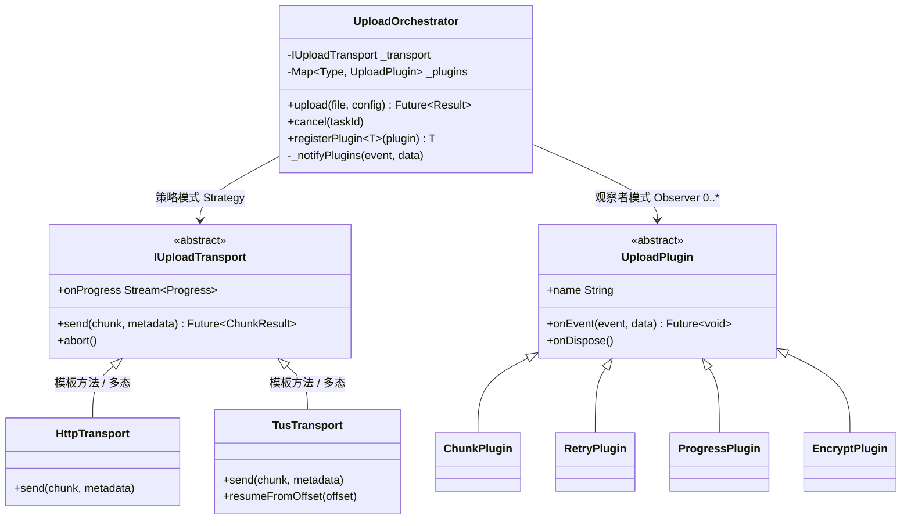

# UI 组件设计与逻辑归类指南

> **加载条件**：前端/客户端项目 且 UI 层需求非平凡时读取。
> 本文以 React 为例展示写法，但原则适用所有前端/客户端技术栈。实际生成时术语和代码必须使用项目真实技术栈。

---

## 前端常见层角色参考

§4 子章节名从 architecture.md 动态读取。以下表提供前端项目中常见层名的角色描述。

| architecture.md 中的层 | 层角色 |
|------------------------|--------|
| Model / Entity / Schema | **模型层** — 后台接口字段的前端镜像，只定义数据长什么样 |
| Repository / Service / API Client | **数据层** — API 调用、缓存、DTO→Model 转换 |
| Bloc / Store / Redux / Hook / Controller | **状态与逻辑层** — 管理模型实例的生命周期；部分项目也在此承载业务逻辑 |
| Page / View / Component / Widget | **UI层** — 组件分层、交互、状态消费 |
| Hooks / Utils / Service / 纯函数 | **逻辑层** — 可复用/可单测逻辑 |
| l10n / router / config | **基础设施** — 路由、国际化、配置 |

### 跨框架术语对照

| 概念 | React | Vue | Flutter | SwiftUI / Android |
|------|-------|-----|---------|-------------------|
| 局部状态 | useState / useRef | ref / reactive | setState / ValueNotifier | @State / mutableStateOf |
| 逻辑封装 | 自定义 Hook | Composable | 自定义方法/Mixin | ObservableObject / ViewModel |
| 全局状态 | Redux / Store | Pinia / Vuex | Bloc / Riverpod | Combine / StateFlow |
| 展示组件 | Props 组件 | Props 组件 | StatelessWidget | View (参数) |
| 依赖注入 | Context | provide / inject | InheritedWidget | EnvironmentObject |

---

## ⛔ 强制输出骨架（生成前必须逐项对照）

> **本节是硬性约束，不是建议。** 下方所有详细说明和正反例都是为了帮你理解本骨架的每一条。
> 生成 §4.4 / §4.5 时，**必须按以下顺序逐项输出**，缺任何一项视为未执行本 guide。

### §4.4 UI 层 — 必须输出的 5 个块（按顺序）

| # | 块名 | MUST 要求 | 偷工减料红线 |
|---|------|-----------|-------------|
| 1 | **§4.4.1 组件树总览** | 缩进树，每个节点标注 `类型`（页面/容器/展示/公共）+ `数据源或核心 props` | 只画树不标类型和数据源 |
| 2 | **§4.4.2 公共组件汇总表** | 表格列出所有可复用组件（已有/需新增），标注复用场景 | 不列或只在逐组件里零散提及 |
| 3 | **§4.4.3 逐组件设计** | **按树顺序**逐个展开；页面/容器组件 MUST 有：数据来源 + 内部状态 + 向下传递 + **职责叙述**（引用块 `>`）；容器组件额外 MUST 有 **"为什么拆"展开说明**；展示组件简单的一行 props 即可 | ① 按"容器/展示"分组而非按树顺序 ② 页面/容器组件缺职责叙述 ③ "为什么拆"只写"职责单一" |
| 4 | **§4.4.4 需求实现链路** | 每条关键需求一条链路：`组件 → 逻辑单元 → 状态/数据层`，每步标明承载方式 | "用户看到列表"一句话带过 |
| 5 | **§4.4.5 关键交互流**（可选） | 复杂异步流程用分步自然语言描述 | 有复杂异步但跳过不写 |

### §4.5 逻辑层 — 必须输出的 4 个块（按顺序）

| # | 块名 | MUST 要求 | 偷工减料红线 |
|---|------|-----------|-------------|
| 1 | **逻辑归属决策** | 明确说清哪些留在组件内、哪些提取出来，附理由 | 不做归属判断，直接列清单 |
| 2 | **逻辑单元清单** | 表格：逻辑单元 / 承载方式 / **消费者（组件）** / 职责 / 覆盖需求 | 缺"消费者"列，逻辑和组件无法对应 |
| 3 | **关键单元接口** | 复杂单元展开写：接口签名（真实语法）+ **设计说明段落**（解决什么问题 / 内部编排 / 关键取舍 / 边界情况，每条不可省略） | 只写签名无设计说明，或设计说明只有一句话 |
| 4 | **复杂逻辑系统**（如有） | 命中复杂度判定（≥2 项）→ 类图 + 模式选型表 + 协作流程 + 边界处理；不命中 → 职责表 + 设计说明即可 | 命中了但只写"使用策略模式" |

### 状态归属 — 贯穿 §4.4 和 §4.5 的硬性约束

每个关键状态 MUST 在组件的"数据来源"或"内部状态"中体现归属决策（类型 + 归属方式 + 用途 + 消费范围）。先跑下方的「状态归属决策树」再写。

---

> **以下是每个骨架项的详细写法说明、正反例和决策树。生成时回来查阅，但输出结构以上方骨架表为准。**

## §4.4 UI 层写作方式

### 核心关注点

作为前端开发者，review TRD 时最关心：
1. **组件如何分层** — 从顶到底有哪些组件，各自什么角色
2. **哪些是公共组件** — 避免重复造轮子
3. **是否需要容器组件** — 简单页面不需要；某区块有独立数据流时才拆
4. **状态放在哪里** — 组件内 vs Hook vs 全局状态，归属是否合理
5. **逻辑如何归类** — Hook vs 纯类 vs 状态管理
6. **数据怎么流转** — 从用户操作到 UI 更新的完整链路


### 写作结构
1. **§4.4.1 组件树总览**：缩进树展示完整层级，每个节点标注类型 + 数据源或核心 props
2. **§4.4.2 公共组件汇总表**：先列全部可复用组件（已有/需新增），建立复用全景
3. **§4.4.3 逐组件设计**：自顶向下逐组件展开,按树顺序逐个展开
    **不分组** — 不要把容器和展示组件分成独立章节。按组件树的自然顺序从上到下写。
> ✅ 正例：按树结构 PageRoot → FilterSection → ContentList 顺序写，reviewer 跟着页面结构读
> ❌ 反例：先写一节「容器组件」列 FilterSection + ContentList，再写一节「展示组件」列 FilterTabs + ListItem —— reviewer 要跳来跳去才能理解父子关系
4. **§4.4.4 需求实现链路**：每条关键需求一条链路，串起「组件 → 逻辑 → 数据」
5. **§4.4.5 关键交互流**（可选）：复杂异步流程用自然语言分步描述
  
**以下是具体描述上述结构要如何落实的指南**


### 组件类型与写法要求

| 类型 | 何时使用 | 写法要求 |
|------|---------|---------|
| **页面组件** | 路由入口，管理页面级数据和状态 | 数据来源 + 内部状态 + 向下传递 + **职责叙述** |
| **容器组件** | 页面内某区块有独立数据流，需从页面组件隔离 | 同上 + **"为什么拆"展开说明**（拆之前什么问题、拆之后什么好处） |
| **展示组件** | 接收 Props 渲染 UI，可有自身交互状态 | 简单的一行 Props；有内部状态或复杂交互的需展开写 |
| **公共组件** | 被多个页面/模块复用 | 加 ⭐ 标记，注明复用场景 |

> **容器组件不是必须的**。简单页面 → 页面组件直接用 Hook / 或组件内发起请求, 拿数据 + 子组件全展示，不需要容器层。
> 只有当某区块需要独立数据获取/状态管理逻辑/编排子组件之间的调用逻辑时，才拆出容器组件。

**✅ 正例 — 正确拆容器**：
FilterSection 内部有"条件管理 → debounce → 触发列表刷新"的完整异步流程 → 拆为容器，自管 debounce

**❌ 反例 — 过度拆容器**：
一个只有 3 个静态配置项的设置页，把每个 SettingItem 都包一个 SettingItemContainer → 纯展示组件不需要容器

**页面和容器组件必须附带职责叙述**（引用块 `>` 格式），篇幅由复杂度决定，使未阅读代码的 reviewer 也能理解该组件的存在理由及其与上下游的协作关系。

> ✅ 正例："PageRoot 作为页面顶层组件，不直接执行数据获取，而是通过两个 Hook 获取数据后分发给三个功能区块。筛选逻辑未放在此处，因为筛选与列表各自有独立的异步流程，合并会导致组件职责过载。"
> ❌ 反例："PageRoot 是页面组件，负责管理状态和渲染子组件。" —— 无实质信息，任何页面组件均可套用此描述

**有数据获取逻辑的组件**（页面或容器）**必须写清它用了哪些逻辑单元**（Hook/Store/工具函数），reviewer 看组件时能直接知道它和逻辑层的关联。

> ✅ 正例：`ContentList` — 数据来源: `useItemsQuery()` → `{ items, loading, fetchNext }` + `useSelector(state => state.filter.conditions)`
> ❌ 反例：`ContentList` — 数据来源: 从后端获取 —— 没说用什么 Hook/Store，实现者不知道该调什么

### 组件树总览示例

**简单页面（无中间容器层）**：
```
SettingsPage (页面, useSettingsData)
├── HeaderBar (公共, props: title, onBack)
├── SettingItem (展示, props: label, value, onChange) × N
└── SaveButton (展示, props: onSave, disabled)
```

**复杂页面（按需引入容器组件）**：
```
PageRoot (页面, usePageInit)
├── HeaderBar (公共, props: title, onBack)
├── FilterSection (容器, useFilterState)
│   ├── FilterTabs (展示, props: tabs, activeId, onChange)
│   └── SearchInput (展示, props: value, onSearch)
├── ContentList (容器, useItemsQuery)
│   ├── ListItem (展示, props: item, onClick) × N
│   └── EmptyState (公共, props: icon, message)
└── ActionFooter (展示, props: onSubmit, disabled)
```

> ✅ 正例：每个节点都标注了类型（页面/容器/展示/公共）和数据源或 props
> ❌ 反例：只画树不标类型和数据源——

```
PageRoot
├── Header
├── Filter
│   ├── Tabs
│   └── Search
└── Content
```
这棵树看不出谁是容器、谁是展示、数据从哪来。

### 逐组件设计示例

**简单页面示例**：

**`SettingsPage`** — 设置页 | 页面 | R-010~R-012
- **数据来源**: `useSettingsData()` → `{ settings, updateSetting, saving }`
- **内部状态**: `editingKey: string | null`（当前编辑项 → useState，仅本组件用）
- **向下传递**: SettingItem 接收 `label` + `value` + `onChange`；SaveButton 接收 `onSave` + `disabled`

  **`SettingItem`** — 展示 | `label, value, onChange, editing`
  - **内部状态**: `inputBuffer`（useState，输入缓冲，失焦时才回调 onChange）

  **`SaveButton`** — 展示 | `onSave, disabled`

**复杂页面示例**：

**`PageRoot`** — 页面 | R-001~R-007
- **数据来源**: `useXxxData()` + `useYyyState()`
- **内部状态**: `activeTab: string`（useState，Tab 切换仅影响渲染哪个子区块）
- **向下传递**: items → ContentList; filters → FilterSection; onSubmit → ActionFooter

> PageRoot 作为页面顶层组件，不直接执行数据获取或复杂逻辑处理，而是通过两个 Hook 获取页面初始化数据，再将数据和回调分发给三个功能区块。筛选逻辑和列表刷新逻辑未集中在 PageRoot 内，因为二者各自有独立的异步流程（筛选需 debounce、列表需分页），合并会导致 PageRoot 膨胀为职责过载的单体组件。

**`FilterSection`** — 容器（独立管理筛选状态 + debounce） | R-005
- **数据来源**: `useFilterState()` → `{ filters, setFilter, resetFilters }`
- **向下传递**: FilterTabs 接收 `activeTab` + `onTabChange`；SearchInput 接收 `keyword` + `onSearch`
- **为什么拆为容器**: 筛选区内部有"条件管理 → debounce → 触发列表刷新"的完整异步流程。留在 PageRoot 里会导致筛选防抖定时器和列表分页游标两套异步状态交织，容易出 bug。拆出来后 FilterSection 自管 debounce，列表只监听条件变化。

**`ContentList`** — 容器（独立管理列表数据获取 + 分页） | R-003, R-004
- **数据来源**: `useSelector(state => state.xxx.items)` + `useDispatch`
- **内部状态**: `refreshing: boolean`（useState，下拉刷新 UI 状态，仅本组件消费）
- **为什么拆为容器**: ContentList 管着首次加载、下拉刷新、筛选变化后重新拉取这整套链路，还要处理空状态兜底。和筛选、提交的异步流隔离开，各管各的。

**❌ 反例 — "为什么拆"偷工减料**：
```
FilterSection — 容器
- 为什么拆为容器: 职责单一
```
"职责单一"属于泛化描述——未说明拆分前的具体问题和拆分后的具体收益，reviewer 无法判断是否过度拆分。

### 需求实现链路示例

```
R-003 列表展示:
  ContentList (容器) → useItemsQuery (Hook) → itemsSlice (Redux) → ItemRepository.fetch (数据层)

R-005 筛选联动:
  FilterSection (容器) → useFilterState (Hook) → dispatch fetchItems(newFilters) → ContentList re-render
```

> ✅ 正例（上面）：从 UI 组件到数据层的完整调用链，每一步标明承载方式
> ❌ 反例："R-003：用户看到列表。" —— 没有链路，实现者不知道数据从哪来

---

### 状态归属决策树

> 每个关键状态都要做归属决策 — 这是 reviewer 最关注的点之一。
> 以下以 React 为例，决策逻辑适用所有技术栈。

```
这个状态只有一个组件用？
├─ YES → 逻辑简单（开关/输入/UI 动画）？
│        ├─ YES → 组件内部局部状态（useState / ref / setState）
│        └─ NO  → 状态转换多（3+ action）？
│                 ├─ YES → 组件内部状态机（useReducer / reactive+switch）
│                 └─ NO  → 含异步/副作用？
│                          ├─ YES → 封装为独立逻辑单元（Hook / Composable / Bloc）
│                          └─ NO  → 局部状态足够
└─ NO  → 多个组件共享
         ├─ 同一组件树内（父子/兄弟）？
         │  ├─ YES → 状态提升到最近公共父组件
         │  └─ 传递层级过深（3+ 层）？
         │     └─ YES → 依赖注入（Context / provide-inject / InheritedWidget）
         └─ 跨页面 / 跨模块 / 需要持久化？
            └─ YES → 全局状态管理（Redux / Pinia / Bloc / StateFlow）
```

**做完上述判断后,要在逐组件设计中的数据来源,内部状态体现出来意图,切记(也就是可以不单独写出这一节,也要把思考的部分填充到逐组件设计的数据部分**

**常见状态归属示例**：

| 状态 | 归属 | 理由 |
|------|------|------|
| 弹窗开关 `isOpen` | useState（组件内部） | 只服务当前组件 UI 切换 |
| 输入框缓冲值 | useState（组件内部） | 展示组件自管输入，debounce 后才回调 |
| 多步表单 step + formData | useReducer（组件内部） | 组件私有但状态转换多 |
| 列表筛选条件 | 自定义 Hook 或提升到父组件 | 被 FilterSection 和 ContentList 共同依赖 |
| API 请求 + loading + error | 自定义 Hook | 含异步副作用，封装后组件只消费结果 |
| 用户登录态 / 全局配置 | Redux / Store | 跨页面共享，需要持久化 |

> TRD 不需要列出每个 `useState(false)` 这样的琐碎状态。**只列出影响组件职责理解的关键状态**。

**✅ 正例 — 状态归属写法**：
```
`editingKey: string | null`（useState，当前编辑项，仅本组件消费）
→ 说清了：类型、归属方式、用途、消费范围
```

**❌ 反例 — 状态归属写法**：
```
内部状态: 若干 useState 管理页面状态
→ 没说有哪些状态、各归属到哪里、为什么这样归
```

**❌ 反例 — 状态提升过度**：
```
把 tooltip 的 isVisible 提升到 Redux 全局状态
→ tooltip 开关只服务单个组件，不需要全局共享，应留在组件内
```

**❌ 反例 — 该提升没提升**：
```
FilterSection 和 ContentList 各自维护一份 filterConditions 副本
→ 两个组件需要同一份数据，应提升到公共父组件或自定义 Hook，否则状态不一致
```

**组件的数据/状态来源不只是 Hook 和 Redux**：

| 来源 | 适用场景 | 示例 |
|------|---------|------|
| 组件内部 useState/useRef | 纯 UI 交互状态、表单输入缓冲、开关/展开收起 | `const [open, setOpen] = useState(false)` |
| 组件内部 useReducer | 组件私有但状态转换逻辑较多 | 多步表单的 step/formData/validation |
| 自定义 Hook | 封装可复用的业务流程（含副作用） | `useItemsQuery()` → `{ items, loading, fetchNext }` |
| 全局状态（Redux/Store） | 跨组件或跨页面共享 | `useSelector(state => state.user.profile)` |
| Props（父组件传入） | 展示组件、受控组件 | `<ListItem item={item} onClick={handleClick} />` |

---

## §4.5 逻辑层写作方式

### 核心问题

§4.4 解决"状态放哪里"，§4.5 解决"逻辑是否提取、提取后用什么承载"。

### 逻辑归属决策

| 留在组件内 | 提取出来 |
|-----------|---------|
| 只服务一个组件的 UI 状态（开关/hover/动画） | 被 2+ 组件共享的逻辑 |
| 3 行以内的简单事件处理 | 包含复杂业务规则（校验/计算/流程编排） |
| 与 UI 强绑定的交互逻辑 | 需要单独测试的业务逻辑 |
| 组件内局部状态可满足需求 | 含异步副作用且需要封装复用 |

**✅ 正例 — 正确留在组件内**：
```jsx
// 按钮 hover 高亮——纯 UI 交互，只服务本组件
const [hovered, setHovered] = useState(false)
```

**✅ 正例 — 正确提取**：
```
// 表单校验逻辑——被 CreatePage 和 EditPage 共用，含复杂业务规则
// → 提取为 useFormValidation() Hook
```

**❌ 反例 — 该提取没提取**：
```jsx
// 在 ComponentA 和 ComponentB 里各写一遍相同的价格计算逻辑
// → 应提取为 calcDiscountPrice() 纯函数
```

**❌ 反例 — 过度提取**：
```
// 把一个只有 onClick={() => setOpen(true)} 的开关逻辑提取为 useDialogToggle() Hook
// → 一行 useState 能解决的事，提取反而增加理解成本
```

### 提取后承载方式

| 承载方式 | 适用场景 | React | 其他技术栈 |
|---------|---------|-------|-----------|
| **封装逻辑单元** | 完整业务流程（状态+副作用） | `useXxxQuery`, `useXxxForm` | Composable / Bloc / ViewModel |
| **全局状态管理** | 跨组件共享、需持久化 | `xxxSlice`, `xxxStore` | Pinia / Riverpod / StateFlow |
| **纯类 / 纯函数** | 复杂规则、算法、校验，无框架依赖 | `XxxValidator`, `formatXxx` | 通用 |
| **公共逻辑** | 多 Feature 复用的基础能力 | `useDebounce`, `usePagination` | 通用 |

**✅ 正例 — 选对承载方式**：

| 逻辑 | 承载方式 | 理由 |
|------|---------|------|
| 列表数据获取 + 分页 + loading | `useItemsQuery` Hook | 含异步副作用，封装后组件只消费 `{ items, loading, fetchNext }` |
| 价格折扣计算 | `calcDiscountPrice()` 纯函数 | 纯计算无副作用，纯函数最易测试 |
| 用户登录态 | `authSlice` Redux | 跨页面共享、需持久化 |

**❌ 反例 — 选错承载方式**：

| 逻辑 | 错误做法 | 问题 |
|------|---------|------|
| 纯计算逻辑（价格换算） | 放进 Hook（`usePrice`） | 无副作用不需要 Hook，纯函数即可 |
| 跨页面共享的用户配置 | 用 useState 在根组件 | 应用全局状态管理，否则页面跳转后状态丢失 |
| 只服务一个组件的 loading 状态 | 放进 Redux | 过度全局化，应留在组件内 |

### 复杂逻辑系统的写法(**当涉及需要实现异步任务编排引擎,动画控制器,canvas渲染引擎,音频引擎等等**)


**复杂度判定——AI 写 TRD 时先跑这个检查**

在为某个逻辑模块编写 TRD 之前，先对 PRD 需求描述和已有代码上下文做以下扫描，命中 **≥ 2 项** → 进入本节的复杂模块写法（类图 + 模式选型 + 协作流程 + 边界处理）；命中 0-1 项 → 用普通写法（职责表 + 设计说明段落即可）。

| # | 检查项 | 怎么判断 | 举例 |
|---|--------|---------|------|
| 1 | **协作实体数** | 完成该需求需要新增或修改的类/模块 ≥ 3 个，且它们之间存在调用或数据传递关系 | 上传引擎需要 Orchestrator + Transport + Plugin 三层 |
| 2 | **抽象层级** | 存在接口/抽象类 + 多个实现，或需要引入新的抽象来屏蔽变化 | `IUploadTransport` → Http / Tus 两种实现 |
| 3 | **异步编排深度** | 异步步骤 ≥ 3 步，且步骤间有顺序依赖、分支或失败回退 | 分片 → 加密 → 发送 → 重试/回退 |
| 4 | **状态复杂度** | 状态 ≥ 3 个，转移条件非 trivial（不是简单的 open/close 切换） | 上传状态：idle → uploading → paused → failed → completed |
| 5 | **扩展点需求** | PRD 中有"后续可能新增 XX"、"支持 XX 可配"等可扩展性要求，或代码中已有插件/策略注册机制 | "后续要支持 S3 协议上传" |
| 6 | **跨层/跨模块副作用** | 该模块的操作会触发其他模块的状态变更、缓存失效、UI 刷新等连锁反应 | 上传完成后需通知文件列表刷新 + 更新配额 |

> **不命中时怎么做**：只写职责表（谁负责什么、关键接口列表）+ 一段设计说明文字。不要硬上 UML 类图和架构模式选型——过度设计的 TRD 比没有 TRD 更有害，因为它会误导实现者以为需要造更多抽象。


当逻辑需要**多个类/模块协作**时，TRD 需要把类结构、架构选型、协作流程、边界处理讲清楚


下面用统一例子 `FileUploadEngine`（文件上传引擎）贯穿所有写作要求。该系统采用**微内核 + 插件**架构。

**1. 类图（mermaid UML）——抽象、继承与组合**

> 图中标注了每组关系对应的设计模式，帮助 reviewer 快速识别设计意图。



> **设计模式速查（本例涉及）**
>
> | 模式 | 在本例中的落位 | 一句话说明 |
> |------|--------------|-----------|
> | **策略模式 (Strategy)** | `IUploadTransport` → `HttpTransport` / `TusTransport` | 运行时切换传输协议，调用方不感知差异 |
> | **观察者模式 (Observer)** | `UploadOrchestrator._notifyPlugins()` → 各 `UploadPlugin` | 编排核心广播事件，插件各自响应，双方解耦 |
> | **模板方法 (Template Method)** | `IUploadTransport.send()` 定义骨架，子类填充协议细节 | 抽象基类固化流程，子类只覆写变化点 |
> | **微内核 (Microkernel)** | `UploadOrchestrator`（内核）+ `UploadPlugin` 体系（扩展） | 核心最小化，能力通过插件按需装载 |

**设计模式伪代码——TRD 中需要写到这个粒度**

> 只展示模式骨架和关键调用关系，省略业务细节。实际 TRD 中应替换为真实类名和业务逻辑。

**Strategy — 传输层运行时可替换**

```pseudo
// 抽象接口
abstract class IUploadTransport {
  Future<ChunkResult> send(Chunk chunk, Metadata meta);
  void abort();
  Stream<Progress> get onProgress;
}

// 实现 A
class HttpTransport extends IUploadTransport {
  Future<ChunkResult> send(chunk, meta) {
    body = buildMultipartBody(chunk, meta);
    return httpClient.post(endpoint, body);
  }
}

// 实现 B
class TusTransport extends IUploadTransport {
  Future<ChunkResult> send(chunk, meta) {
    offset = getServerOffset(meta.taskId);
    return tusClient.patch(endpoint, chunk, offset);
  }
  Future<void> resumeFromOffset(int offset) { ... }
}

// 调用方——只依赖抽象，不知道具体协议
class UploadOrchestrator {
  IUploadTransport _transport;

  UploadOrchestrator(this._transport);          // 构造注入
  // 也可运行时切换：
  void switchTransport(IUploadTransport t) => _transport = t;
}
```

**Observer — 插件事件广播**

```pseudo
abstract class UploadPlugin {
  String get name;
  Future<void> onEvent(UploadEvent event, dynamic data);
  void onDispose();
}

class UploadOrchestrator {
  final List<UploadPlugin> _plugins = [];

  void registerPlugin(UploadPlugin p) => _plugins.add(p);

  // 广播——所有插件各自响应，互不感知
  Future<void> _notifyPlugins(UploadEvent event, dynamic data) async {
    for (final p in _plugins) {
      try {
        await p.onEvent(event, data);
      } catch (e) {
        log.warn('Plugin ${p.name} error on $event: $e');
        // 单个插件异常不中断主链路
      }
    }
  }
}

// 具体插件——只关心自己监听的事件
class RetryPlugin extends UploadPlugin {
  String get name => 'retry';
  Future<void> onEvent(UploadEvent event, data) async {
    if (event != UploadEvent.onError) return;   // 只响应 onError
    final chunk = data as FailedChunk;
    if (chunk.retryCount < maxRetry) {
      await Future.delayed(backoff(chunk.retryCount));
      orchestrator.reEnqueue(chunk);
    }
  }
}
```

**Microkernel — 内核最小化 + 插件装载**

```pseudo
class UploadOrchestrator {                      // ← 微内核
  IUploadTransport _transport;
  List<UploadPlugin> _plugins;

  Future<UploadResult> upload(File file, UploadConfig config) async {
    await _notifyPlugins(beforeUpload, file);    // 插件预处理（分片、加密…）

    for (final chunk in chunkQueue) {
      await _notifyPlugins(beforeChunk, chunk);
      result = await _transport.send(chunk);     // 委托传输层
      await _notifyPlugins(afterChunk, result);
    }

    await _notifyPlugins(onComplete, summary);
    return summary;
  }
}

// 使用方组装——按需装载能力
final engine = UploadOrchestrator(TusTransport())
  ..registerPlugin(ChunkPlugin(chunkSize: 5.mb))
  ..registerPlugin(EncryptPlugin(algorithm: aes256))
  ..registerPlugin(RetryPlugin(maxRetry: 3))
  ..registerPlugin(ProgressPlugin(onProgress: updateUI));

engine.upload(file, config);
```

> ❌ 反例——TRD 只写"使用策略模式切换传输协议"，没有伪代码 → 实现者不知道注入点在构造函数还是 setter、切换时是否需要 abort 旧实例
>
> ✅ 正例——上面的伪代码粒度：看完就知道抽象接口有哪些方法、注入方式、插件生命周期钩子、异常隔离策略

**2. 模块图——微内核架构总览**

```mermaid
graph LR
    subgraph 微内核
        Core["UploadOrchestrator\n编排入口"]
    end
    subgraph 传输层（可替换）
        HTTP[HttpTransport]
        TUS[TusTransport]
    end
    subgraph 插件体系（可插拔）
        P1["ChunkPlugin\n分片"]
        P2["RetryPlugin\n重试退避"]
        P3["ProgressPlugin\n进度"]
        P4["EncryptPlugin\n加密"]
    end
    Core -->|IUploadTransport| HTTP
    Core -->|IUploadTransport| TUS
    Core -.->|"beforeUpload / afterChunk / onError"| P1 & P2 & P3 & P4
```

**3. 职责表**

| 模块 | 职责边界 | 关键接口 | 不能负责什么 |
|------|---------|---------|-------------|
| `UploadOrchestrator` | 接收上传请求，编排「分片 → 传输 → 插件通知 → 状态收敛」 | `upload()`, `cancel()`, `registerPlugin()` | 不实现具体传输协议，不内嵌重试/加密逻辑 |
| `IUploadTransport`（抽象） | 屏蔽 HTTP / TUS 等协议差异 | `send()`, `abort()`, `onProgress` | 不管理插件，不决定分片策略 |
| `HttpTransport` | 标准 HTTP multipart 上传 | 内部拼装 multipart body | 不处理断点续传 |
| `TusTransport` | tus 协议断点续传 | `resumeFromOffset()` | 不处理加密 |
| `UploadPlugin`（抽象基类） | 定义插件生命周期钩子 | `onEvent()`, `onDispose()` | — |
| `ChunkPlugin` | `beforeUpload` 阶段将大文件切为分片队列 | 监听 `beforeUpload` | 不发送网络请求 |
| `RetryPlugin` | `onError` 阶段按指数退避重新入队失败分片 | 监听 `onError` | 不判断业务冲突 |
| `ProgressPlugin` | 汇总各分片完成情况，对外暴露总进度流 | 监听 `afterChunk` | 不修改上传数据 |
| `EncryptPlugin` | `beforeChunk` 阶段对分片做端到端加密 | 监听 `beforeChunk` | 不负责传输 |

> ❌ 反例（只有骨架）：`UploadManager — 管理上传`；`Helper — 辅助功能` → 无实质信息

**4. 架构模式选型——为什么这样拆**

| 设计点 | 设计模式 | 落位 | 为什么选 | 为什么不选更简单方案 |
|-------|---------|------|---------|-------------------|
| 微内核 + 插件 | Microkernel | `UploadOrchestrator` + `UploadPlugin` 体系 | 分片、重试、加密、进度属于横切能力，需按需启停 | 全部写进 Orchestrator 会迅速膨胀到不可维护 |
| 传输层抽象 | Strategy | `IUploadTransport` → Http / Tus | 不同场景需要不同传输协议，上层不关心协议细节 | 直接依赖具体实现后，平台差异泄漏到每个调用点 |
| 插件通知机制 | Observer | `_notifyPlugins(event, data)` 广播 | 插件间无依赖，编排层不需要知道哪些插件被注册 | 逐一硬编码调用，每加一个插件就改一遍主流程 |
| 传输协议实现 | Template Method | `IUploadTransport.send()` 骨架 + 子类覆写 | 公共流程（鉴权、日志、超时）固化在基类，子类只关心协议差异 | 每个实现类重复编写公共逻辑 |

> ❌ 反例："使用微内核架构。" —— 没说核心是谁、扩展点在哪、新增插件改哪里
>
> ❌ 反例 — 过度设计："只有 2 种状态的 tooltip，用状态机实现。" —— 一个 boolean 即可满足

**5. 协作流程（组合方式）——同一个例子连续展开**

> **场景：上传 200MB 文件，启用分片 + 加密 + 断点续传**
>
> 1. 页面调用 `UploadOrchestrator.upload(file, config)`，config 指定 `TusTransport` + 启用 `ChunkPlugin` / `EncryptPlugin`。
> 2. Orchestrator 广播 `beforeUpload`。`ChunkPlugin` 将 200MB 切为 5MB × 40 个分片，写入分片队列。
> 3. 逐片处理：广播 `beforeChunk` → `EncryptPlugin` 加密当前分片 → `TusTransport.send(chunk)` 发送。
> 4. 每片成功后广播 `afterChunk`，`ProgressPlugin` 更新总进度，`RetryPlugin` 清除该片失败计数。
> 5. 某片失败 → 广播 `onError` → `RetryPlugin` 指数退避（1s → 2s → 4s，上限 30s）重新入队；连续 3 次失败标记任务 `failed`。
> 6. 用户取消 → `cancel()` → `TusTransport.abort()` 中断请求 → 逐一调用各插件 `onDispose()` 清理资源。
> 7. 应用重启恢复 → `TusTransport.resumeFromOffset()` 从上次成功偏移量继续，无需重传已完成分片。

> ❌ 反例："UploadOrchestrator 调用 ChunkPlugin 和 TusTransport 完成上传。" —— 没说调用顺序、分片怎么流转、失败谁处理

**6. 边界与异常**

| 关注点 | TRD 至少要写清什么 |
|-------|------------------|
| 并发上传 | 同一文件是否允许两个同时上传任务 |
| 分片顺序 | TUS 要求顺序上传，HTTP 可并行——选哪个、为什么 |
| 插件异常 | 单个插件 `onEvent` 抛错是否中断主链路（通常吞掉并记录） |
| 大文件内存 | 分片是全部加载到内存，还是流式读取 |
| 网络切换 | WiFi → 4G 是否重置传输层实例 |
| 加密失败 | 回退明文上传还是中止任务 |

> 写作时把**类图、模式选型、协作流程、取舍、边界**连成同一个例子的完整证据链。

### 写作结构

1. **逻辑归属决策**：什么留在组件内，什么提取出来
2. **逻辑单元清单**：每个单元标明「消费者（组件）」建立双向关联

| 逻辑单元 | 承载方式 | 消费者 | 职责 | 覆盖需求 |

3. **关键单元接口**：仅复杂单元展开写 — 接口签名 + **设计说明段落**
4. **复杂逻辑系统**（如有）：类/模块职责表 + 协作关系（图） + 设计模式选型理由 + 组合流程

**设计说明段落必须覆盖**（⚠️ 每一条都不可省略）：
- **解决什么问题**：这个逻辑单元存在的理由——不提取会怎样？
- **内部编排的核心思路**：分几步、各步之间的关系（并行？串行？有依赖？）、数据怎么流转
- **关键取舍**：为什么选这种编排而不是另一种（如为什么并行不选串行、错误只记不抛、为什么提成纯函数而不是放在 Hook 里等）
- **边界情况**：有哪些值得单测覆盖的边界（如输入为空、超时、并发竞态等）
- 若涉及多类协作：各类职责边界、调用关系、为什么这样拆而不是合成一个

> ✅ 正例 — 设计说明段落：

> **useItemsQuery** — 封装列表数据获取 + 分页 + 缓存
>
> **解决什么问题**：列表获取涉及首次加载、下拉刷新、筛选变化后重新拉取、分页加载四种触发场景。如果留在组件内，四个 useEffect 交织在一起，竞态条件极难处理（如：上一次筛选请求还没回来，用户又改了筛选条件）。
>
> **内部编排**：维护一个 `requestId`（自增计数器）。每次发起请求时 requestId++，响应回来后对比 requestId——若已过期则丢弃，避免旧请求覆盖新结果。分页通过 `cursor` 实现，追加而非替换。
>
> **关键取舍**：选 cursor 分页而非 offset 分页，因为列表可能有实时新增数据，offset 会导致重复/遗漏。错误只 setState 不 throw，因为 UI 需要展示错误态而非崩溃。
>
> **边界情况**：筛选条件变化时重置 cursor 为 null；请求中组件卸载时 abort 请求；空列表 vs 加载中 vs 错误三态互斥。

> ❌ 反例 — 设计说明偷工减料：
> "useItemsQuery 封装了列表数据获取逻辑，返回 items、loading、error。" —— 没说编排思路、竞态处理、为什么这样设计

**⚠️ 黄金样本 `examples/high-quality-trd.md` 中的逻辑层只涉及简单的 Hook 和纯函数场景。当遇到以下更复杂的情况时，设计说明的深度必须超过黄金样本**：

| 复杂场景 | 设计说明最低要求 |
|---------|----------------|
| 多步异步编排（≥3 步串/并行） | 分步描述完整流程 + 每步的成功/失败处理 + 步骤间的数据传递 + 整体超时/取消策略 |
| 多类/多模块协作（≥3 个类） | 类职责表 + 协作关系图（mermaid） + 为什么这样拆而不是更少/更多的类 |
| 设计模式选型（策略/观察者/状态机等） | 为什么选这个模式 + 考虑过哪些替代 + 扩展点在哪里 + 新增变体时改哪里 |
| 状态机/多状态流转 | 状态枚举 + 转移条件表或状态图 + 非法转移的防御策略 |
| 缓存/数据同步 | 缓存失效策略 + 一致性保证 + 竞态处理 |

**❌ 典型偷工减料**（遇到上述复杂场景时绝不允许）：
- "封装为 XXXManager 类，负责管理 XXX" — 一句话带过，没说内部怎么编排
- "使用策略模式处理多种类型" — 没说为什么选策略模式、有几种策略、扩展时改哪里
- "通过 EventBus 通信" — 没说谁发谁收、事件流转路径、为什么不用直接调用
- 只列类名和一句话职责，没有协作关系和组合流程

> 行为描述不要用压缩箭头链（如 `mount → fetch → abort`），用分步骤自然语言叙述。
>
> ✅ 正例："1. 组件挂载时调用 fetch() 发起请求  2. 若组件在请求返回前卸载，abort 信号取消请求  3. 请求成功后更新 state，触发 re-render"
> ❌ 反例："mount → fetch → abort" —— 看不出 abort 在什么条件下触发

---

## TRD不需要写的

- ❌ 展示组件的 render 函数实现
- ❌ 每个组件的完整 Props interface（简单组件一行表格够了）
- ❌ 琐碎 UI 状态（纯开关 `useState(false)`、hover 效果 — 除非影响理解组件职责）
- ❌ CSS/样式细节
- ❌ 每个 useEffect 的依赖数组
- ❌ import 语句

> ✅ 正例 — 简单展示组件的写法：`SettingItem` — 展示 | `label, value, onChange, editing`（一行足矣）
> ❌ 反例 — 过度细节：
```typescript
interface SettingItemProps {
  label: string
  value: string | number
  onChange: (val: string) => void
  editing: boolean
  className?: string
  style?: React.CSSProperties
  testId?: string
}
```
→ TRD 不是 TypeScript 声明文件，简单展示组件列核心 props 即可

